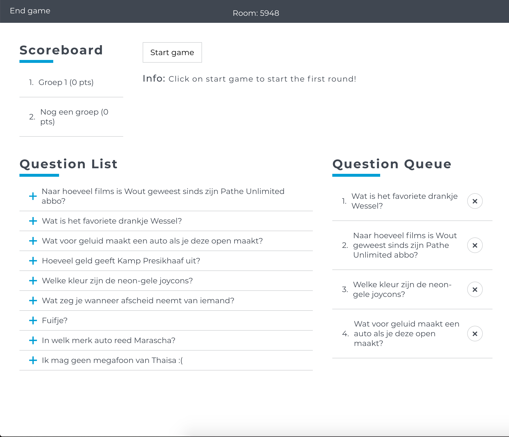
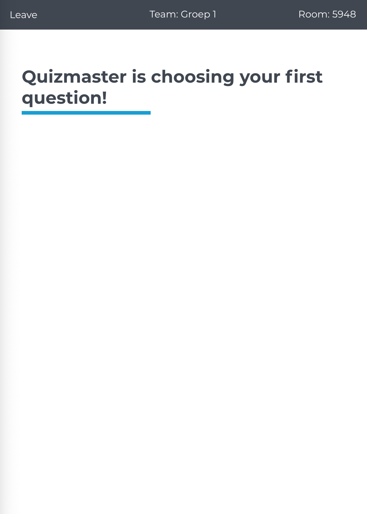

# Shotz

Shotz is an interactive quiz application created with React + Redux and NodeJS + Express on the backend. DB used is MongoDB with Mongoose for accessing it.

Shotz was created for an assignment. We were given about two weeks to write this application in duos. The application is stable, except for the "scoreboard" client app. It works but it still has some bugs.

